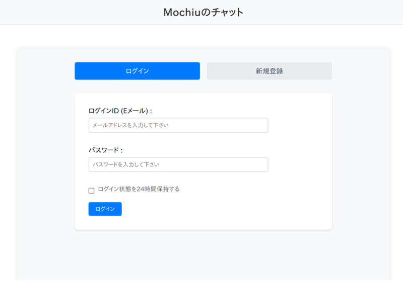
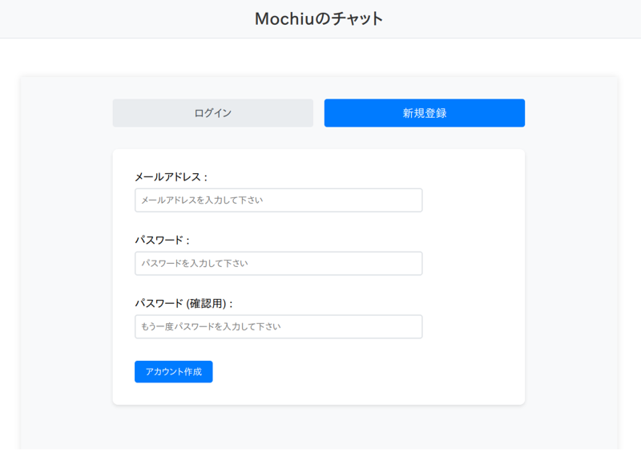
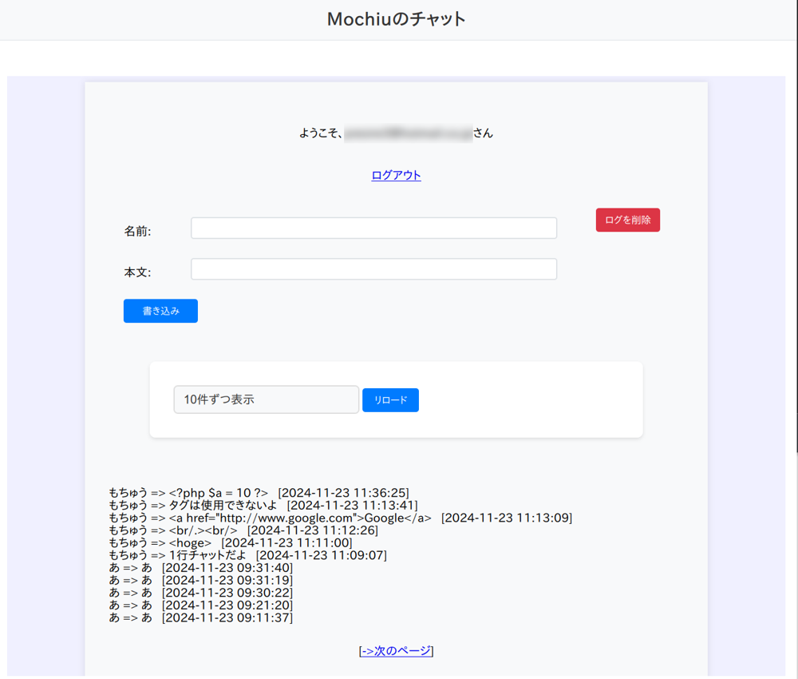

# PHP-Chat
 

URL : https://github.com/presire/PHP-Chat  
 

# はじめに  
PHP-Chatは、PHPの学習用に作成したPHP, HTML, CSS, MySQLのみで動作する1行チャットです。  
簡易的なアカウント作成機能、ログイン機能等を備えています。  

DIコンテナを定義して、データベースクラスを管理・操作しています。  
 

PHP-Chatは、PHP 8.3 および MySQL 8 で動作確認しています。  
 

  

  

  
 
 

# データベース設定ファイル (config/db.iniファイル)  
configディレクトリにdb.iniファイルがあります。  
これは、データベースの接続に関する設定が記述されています。  

必要な場合は、自身の環境に合わせて編集してください。  

なお、<code>DB_NAME="chatdb"</code>は固定値であるため、編集しないでください。  

    [MYSQL]  
    DB_HOST="localhost"  
    DB_NAME="chatdb"  
    DB_USER="root"  
    DB_PASS="root"  
    DB_PORT=3306  
 
 

# 使用するデータベーススキーマ  
MySQL 8 - chatdbデータベース  

    CREATE DATABASE IF NOT EXISTS chatdb  
    CHARACTER SET utf8mb4  
    COLLATE utf8mb4_unicode_ci;  
 
 

# 使用するテーブルスキーマ
MySQL 8 - chatlogテーブル  

    CREATE TABLE IF NOT EXISTS chatlog (  
        log_id INT AUTO_INCREMENT PRIMARY KEY,  
        name   VARCHAR(255),  
        body   TEXT,  
        ctime  DATETIME,  
        INDEX  idx_chatlog_ctime (ctime)  
    ) ENGINE=InnoDB DEFAULT CHARSET=utf8mb4 COLLATE=utf8mb4_unicode_ci; 
 

MySQL 8 - loginテーブル 

    CREATE TABLE IF NOT EXISTS login (  
        login_id varchar(255) COLLATE utf8mb4_unicode_ci NOT NULL,  
        password varchar(255) COLLATE utf8mb4_unicode_ci NOT NULL,  
        remember_token varchar(255) COLLATE utf8mb4_unicode_ci DEFAULT NULL,  
        token_expires_at timestamp NULL DEFAULT NULL, 
        last_login_at timestamp NULL DEFAULT NULL,  
        PRIMARY KEY (login_id), 
        KEY idx_login_id (login_id),  
        KEY idx_remember_token (remember_token),  
        KEY idx_token_expires (token_expires_at)  
    ) ENGINE=InnoDB DEFAULT CHARSET=utf8mb4 COLLATE=utf8mb4_unicode_ci; 
 
 

# コンテナの使用
もし、Podman ComposeあるいはDocker Composeを使用して構築する場合は、以下の手順を実行してください。  

まず、mysql_dataディレクトリにパーミッションを付与します。  

    cd container  
    chmod a+rwx mysql_data  
 

以下のコマンドを実行して、PHP-FPM、NginX、MySQLコンテナを作成してください。  

    # Podmanの場合
    podman-compose up -d  

    # Dockerの場合
    docker-compose up -d  
 

また、コンテナを使用する場合は、データベースやテーブルは手動で作成する必要があるかもしれません。  

    # chatdbデータベースの作成  
    CREATE DATABASE IF NOT EXISTS chatdb  
    CHARACTER SET utf8mb4  
    COLLATE utf8mb4_unicode_ci;  

    use chatdb;

    # chatlogテーブルの作成  

    CREATE TABLE IF NOT EXISTS chatlog (  
        log_id INT AUTO_INCREMENT PRIMARY KEY,  
        name   VARCHAR(255),  
        body   TEXT,  
        ctime  DATETIME,  
        INDEX  idx_chatlog_ctime (ctime)  
    ) ENGINE=InnoDB DEFAULT CHARSET=utf8mb4 COLLATE=utf8mb4_unicode_ci;  

    # loginテーブル の作成
    CREATE TABLE IF NOT EXISTS login (  
        login_id varchar(255) COLLATE utf8mb4_unicode_ci NOT NULL,  
        password varchar(255) COLLATE utf8mb4_unicode_ci NOT NULL,  
        remember_token varchar(255) COLLATE utf8mb4_unicode_ci DEFAULT NULL,  
        token_expires_at timestamp NULL DEFAULT NULL, 
        last_login_at timestamp NULL DEFAULT NULL,  
        PRIMARY KEY (login_id),  
        KEY idx_login_id (login_id),  
        KEY idx_remember_token (remember_token),  
        KEY idx_token_expires (token_expires_at)  
    ) ENGINE=InnoDB DEFAULT CHARSET=utf8mb4 COLLATE=utf8mb4_unicode_ci;  
 

最後に、http://localhost:8000/public/login.php にアクセスして、ページが正常に表示されるかどうかを確認してください。  